# 👋 Olá, eu sou o R. Martins Nàscimento!

### Engenheiro de Dados Industriais & Sistemas de IA (OT/IT & Plataforma)
*Unindo a robustez da operação industrial à escalabilidade de pipelines analíticos e protocolos modernos de IA (Python, SQL, TypeScript, MCP, Dagster, DuckDB, Docker)*

  
  
  

  

---

## ⚡ Sobre Mim

Trabalho na intersecção crítica entre a **Tecnologia da Operação (OT)** e a **Tecnologia da Informação (IT)**. Minha bagagem técnica une a graduação em **Ciência da Computação** e um **MBA em Engenharia de Software** com **7 anos de vivência diária de campo em operações industriais na Veolia Water Tech**.

No chão de fábrica, aprendi que a qualidade do dado na origem é crítica: um sinal de telemetria corrompido não é apenas uma linha em branco em um relatório, é um risco operacional real que pode impactar a produtividade da planta. Hoje, traduzo essa visão prática no desenvolvimento de pipelines analíticos, modelagem dimensional e governança de qualidade de dados para monitoramento e suporte à decisão.

---

## 🛠️ Matriz de Competências (Stack Técnico)

| 🏭 Automação & Campo (OT) | 💻 Engenharia de Dados & Analytics | 🤖 Protocolos de IA & Plataforma (Core) |
| :--- | :--- | :--- |
| **Sistemas Supervisórios**: SCADA, SDCD | **Linguagens & Processamento**: Python, SQL Avançado, Pandas, Polars | **Protocolos & Agentes**: Model Context Protocol (MCP - stdio/HTTP), Tool Calling seguro |
| **Protocolos Industriais**: OPC-UA, ModbusTCP | **Orquestração & Governança**: Dagster, Apache Airflow, Great Expectations, Pydantic | **Linguagens & Runtime**: TypeScript, Node.js, Next.js, FastAPI |
| **Historiadores**: AVEVA PI System (OSIsoft PI) | **Armazenamento Analítico**: DuckDB, Parquet (Lakehouse), PostgreSQL, SQLite (WAL) | **Segurança & Resiliência**: Fail-Closed Fencing, Rate Limiting, Prevenção de Prototype Pollution |
| **Borda & Lógica**: Codesys, Node-RED | **Modelagem**: Star Schema (Kimball), Feature Store | **Deploy & Infraestrutura**: Docker, Kubernetes, Helm Charts, Git CI/CD |

---

## 🚀 Projetos em Destaque

### 🌐 [LibreDB Studio: Servidor MCP Oficial (Upstream Contribution)](https://github.com/libredb/libredb-studio)
*Implementação do servidor oficial Model Context Protocol (MCP) para o LibreDB Studio, viabilizando integração segura entre agentes de IA e múltiplos motores de banco de dados.*
*   **O que faz**: Adiciona endpoint `/api/mcp` (HTTP) e transporte local via stdio com ferramentas de inspeção de esquemas e execução segura de consultas analíticas (`list_connections`, `inspect_schema`, `run_read_query`).
*   **Destaque Técnico**: Barreira de execução *fail-closed* contra instruções destrutivas, proteção contra *prototype pollution* (`__proto__`), orçamento estrito de wire (limite de 64KB e teto determinístico de linhas), cancelamento atômico de queries com heartbeat, suporte multi-SO a SQLite WAL somente leitura, suíte completa de testes unitários e de integração, além de empacotamento com Helm Charts e CLI npx.
*   **Rastreabilidade**: Aceito e integrado na branch principal via [PR #1070](https://github.com/libredb/libredb-studio/pull/1070) (commit [b384395](https://github.com/libredb/libredb-studio/commit/b384395012b70e3f82f1d35cb53b1149762417ca)).
*   **Stack**: TypeScript, Next.js, Node.js, Model Context Protocol (MCP SDK), SQLite, Docker, Helm, Vitest.

### 🏎️ [OpenF1 Data Platform (Lakehouse + MLOps)](https://github.com/Roberton003/openf1-data-platform)
*Plataforma de engenharia de dados para telemetria de Fórmula 1 em alta frequência — Arquitetura Medalhão serverless sobre Parquet e DuckDB.*
*   **O que faz**: Ingere telemetria da OpenF1 API (~3.7Hz), orquestra Bronze/Silver/Gold com **Dagster** (assets declarativos com linhagem), e serve predições via **FastAPI** + DuckDB em memória com concorrência otimizada.
*   **Destaque Técnico**: Ingestão resiliente (retentativas exponenciais com `tenacity`), contratos de dados **Pydantic** na camada Silver, **ASOF JOIN** no DuckDB para alinhar sinais de frequências distintas (GPS ~1.5Hz × telemetria ~3.7Hz), e Feature Store na Gold para modelos preditivos de degradação de pneus.
*   **Stack**: Python, Dagster, DuckDB, Parquet, FastAPI, Pydantic, Plotly, scikit-learn.

### 🎛️ [LabTelemetry (IoT & SCADA Dashboard)](https://github.com/Roberton003/labtelemetry)
*Um simulador completo de Estação de Tratamento de Processo Químico integrando a camada de automação física (OT) com a nuvem analítica (IT).*
*   **O que faz**: Simula leituras de sensores em tempo real (pH, Turbidez, TOC) simulando protocolo **ModbusTCP** em tempo real.
*   **Destaque Técnico**: Ingestão via **Django/Python** no banco PostgreSQL/SQLite com tratamento estatístico de anomalias e desvios de calibração (**Data Quality & Sensor Drift**).
*   **Stack**: Python, Django 5, SQLite, Chart.js, Docker.

### 🚌 [projeto_sptrans (Real-Time Ingestion & Analytics)](https://github.com/Roberton003/projeto_sptrans)
*Pipeline de processamento e roteamento de transporte público com ingestão contínua em tempo real.*
*   **O que faz**: Consome dados de telemetria GPS e previsões de chegada de ônibus da cidade de SP via API Olho Vivo com tratativas de retentativas e concorrência.
*   **Destaque Técnico**: Coleta multi-thread assíncrona, orquestração dockerizada e dashboard interativo para análise de rotas e atrasos no Streamlit.
*   **Stack**: Python 3.11, Docker, Docker Compose, Pandas, Streamlit.

### 🇺🇳 [projeto_oms (WHO GHO Data Warehouse)](https://github.com/Roberton003/projeto_oms)
*Data Warehouse estruturado focado no monitoramento global de indicadores de saúde humana.*
*   **O que faz**: Pipeline ETL que consome a API OData da Organização Mundial da Saúde, processa milhões de registros e popula um modelo analítico de dados.
*   **Destaque Técnico**: Modelagem dimensional rigorosa (**Kimball Star Schema**) com tabelas Fato e Dimensão, orquestrado via **Airflow** e validado com **Great Expectations**.
*   **Stack**: Python, Apache Airflow, Great Expectations, SQLite.

---

## 🎓 Certificações e Formação  
- Bacharelado em **Ciência da Computação**  
- MBA em **Engenharia de Software**  
- **Elastic Google Cloud Infrastructure: Scaling and Automation**  
- **Google Cloud Fundamentals: Core Infrastructure**  
- **Técnicas Avançadas de Python**  
- **DevOps & Cloud (Linux, Docker, Kubernetes, AWS)**  

---

  
